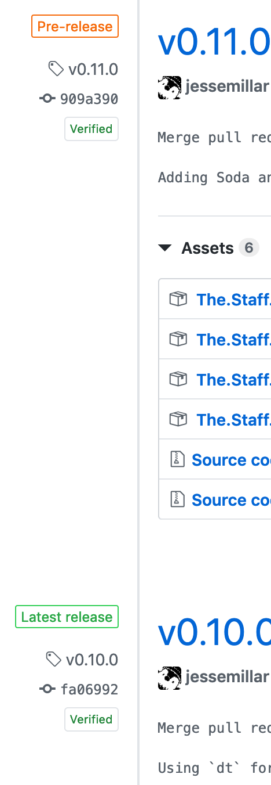

## Tagging
This repo is for testing a couple theories on how my work team can use tags as part of our CI/CD pipeline to organize our builds. Also experimentation with hotfixes.

## Lifecycle
1. Merge to `master`
1. The merge commit is tagged as a version with an `-alpha` suffix (e.g. `v1.0.0-alpha`)
1. That version is deployed to dev and a smoke test is performed
1. If the smoke test passes, the version is "promoted" by creating a new tag for the same commit with a `-beta` suffix and tested more thoroughly in QA (e.g. `v1.0.0-beta`)
1. If the QA tests pass, the version is "promoted" again by creating another new tag with a `-rc` suffix and tested in QA-INT (e.g. `v1.0.0-rc`)
1. If the QA-INT tests pass, the version is marked as ready to deploy by creating a final tag with just the version number in Semantic Versioning style (e.g. `v1.0.0`)

## Notes
- This repo is following the versioning standard outlined above and you can [see the tags here](https://github.com/jessemillar/tagging/tags)
- This version numbering style is in line with version number precedence [as outlined by the Semantic Versioning standard](https://semver.org/#spec-item-11)
- A regex for checking the validity of a Semantic Versioning number can [be found here](https://rgxdb.com/r/40OZ1HN5)
- Having multiple Git tags tracking a version's testing lifecycle will make debugging the CI/CD pipeline and monitoring the testing progress of releases easier and more transparent
- GitHub has a "Releases" system on top of Git tags that allows for descriptive changelogs and uploading artifacts for easy retrieval (screenshot shown below)
	- We could use something like [`ghr`](https://github.com/tcnksm/ghr) to create our final tag (e.g. `v1.0.0`) and upload our artifact file at the same time for easy download through GitHub

> In the screenshot below, `v0.11.0` is marked as a "Pre-release" in GitHub (this can be done via the GitHub UI or via CLI utilities like `ghr`) which tells GitHub to display `v0.10.0` as the latest release since `v0.11.0` isn't done being fully tested.

Poots.

Test
